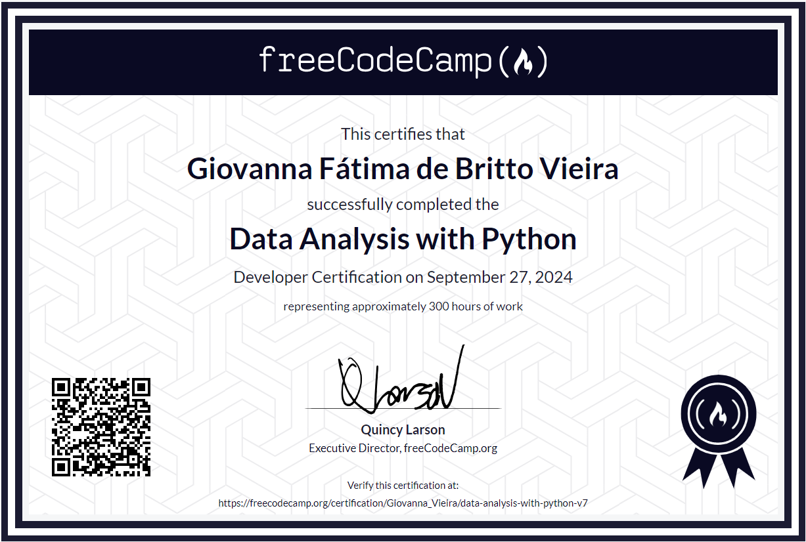

# Atividade Ponderada Semana 01 - Análise de Dados com Python

### Estudante: Giovanna Fátima de Britto Vieira

Conforme proposto na semana 01, após a realização das aulas e dos exercícios propostos, foi feito o desenvolvimento dos projetos do curso de análise de dados. Sendo assim, essa documentação visa especificar os projetos desenvolvidos conforme as instruções da atividade.

### 1. Instruções

Este curso da FreeCodeCamp oferece um conjunto de aulas (vídeos + exercícios) sobre Python para que você estude ao longo do módulo. Durante o curso, você deverá realizar 5 projetos individuais de diferentes níveis de dificuldade, e a nota que você obter ao final do curso por esses projetos será a pontuação desta atividade. Ao completar o curso, você terá inclusive direito a um certificado! Siga as instruções no enunciado da "pergunta".

1. Acesse o link do curso e abra uma conta com seu e-mail Inteli

2. Ao entrar, acesse Menu > Settings, defina um username mais amigável e preencha seu cadastro com o necessário para obter certificado ao final

3. Na seção "Academic Honesty Policy" leia a política de honestidade acadêmica e confirme em "I agree with..." ATENÇÃO: leve bastante a sério esta conduta! O Freecodecamp possui sistemas de verificação de plágio, e suas entregas serão verificadas. Não se arrisque usando códigos prontos da Internet ou de IAs generativas.

4. Agora sim, clique novamente no link dessa atividade para acessar a página do curso

5. O curso é dividido em três partes:

5.1 Data Analysis with Python: o curso em si possui 28 aulas de aproximadamente 12 minutos cada, sempre com uma pergunta ao final

5.2 Numpy: é um curso complementar sobre a biblioteca Numpy

5.3 Data Analysis with Python Projects: aqui estão os 5 projetos que você deve entregar. Cada um deles possui uma página com instruções

6. Cada projeto possui um template de código no Gitpod (um VS Code online) e você poderá executar seu projeto ali mesmo (você deverá criar uma conta no Gitpod para poder acessar) ou na ferramenta de sua preferência. 

7. Em cada projeto, você precisará abrir um repositório no seu github pessoal do Inteli, e vincular o template do Gitpod a esse repositório. Instruções aqui nesse link: https://forum.freecodecamp.org/t/how-to-use-gitpod-in-the-curriculum/668669

7. Ao final de cada projeto, você deve submeter o link de seu Github contendo o código alterado.

8. Completando os 5 projetos (ou o quanto você conseguir), você deve demonstrar ao seu professor(a) dentro do prazo para obter sua nota. Prepare-se para eventualmente responder perguntas sobre suas entregas.

---
### 2. Projeto 1: Mean-Variance-Standard Deviation Calculator
O [primeiro projeto](./Projeto%20Calculadora/) consistiu na criação uma função chamada `calculate()` que realiza cálculos estatísticos em uma matriz 3x3 gerada a partir de uma lista de 9 números. Dessa forma, foi utilizado a biblioteca `Numpy`, e foram calculadas estatísticas para as linhas, colunas e matriz, como por exemplo média, variância, desvio padrão, valores máximos e mínimos, e soma.

#### Desenvolvimento
1. **Verificação de Entrada**:
   - A função começa verificando se a lista fornecida contém exatamente 9 elementos. Caso contrário, é levantada uma exceção `ValueError` para alertar sobre a entrada inválida.

2. **Transformação para Matriz 3x3**:
   - Uma vez validada a entrada, a lista é convertida para um `numpy array` e, em seguida, é transformada em uma matriz de forma 3x3 usando o método `.reshape()`, permitindo que todos os cálculos sejam feitos pelo `Numpy`.

3. **Cálculo das Estatísticas**:
   - Usando as funcionalidades da biblioteca `Numpy`, foram calculados os seguintes valores para a matriz:
     - **Média (`mean`)**: Calculada para as colunas, linhas e para a matriz completa.
     - **Variância (`variance`)**: Mede a dispersão dos dados ao redor da média.
     - **Desvio Padrão (`standard deviation`)**: Calcula a raiz quadrada da variância para fornecer uma medida de dispersão na mesma unidade dos dados.
     - **Máximo (`max`)** e **Mínimo (`min`)**: Identifica os valores extremos para colunas, linhas e matriz completa.
     - **Soma (`sum`)**: Calcula a soma dos elementos para colunas, linhas e matriz completa.
   - Os resultados foram organizados em um dicionário chamado `calculos`, onde cada chave é o nome da estatística e o valor é uma lista de resultados: para colunas (axis=0), linhas (axis=1) e para a matriz achatada.

4. **Retorno dos Resultados**:
   - A função retorna um dicionário `calculos` contendo todas as estatísticas calculadas em listas, tornando possível visualizar facilmente as estatísticas para diferentes perspectivas da matriz.

#### Resultados Obtidos
- A função `calculate()` foi capaz de transformar uma lista de 9 números em uma matriz 3x3 e calcular eficientemente várias estatísticas úteis para análise de dados. Os resultados foram apresentados de forma organizada, facilitando a interpretação e comparação das estatísticas para colunas, linhas e para a matriz completa.

#### Conhecimentos Adquiridos
Por meio da realização do projeto foi possível adquirir os seguintes conhecimentos: 
- **Manipulação de Matrizes com `Numpy`**
- **Cálculos Estatísticos Automatizados**
- **Estruturação de Dados para Retorno**
- **Validação de Entrada**

#### Desafios e Soluções
Além disso, durante o desenvolvimento desse projeto foi possível identificar os seguintes desafios e as soluções encontrada para cada um deles.

Desafio | Descrição | Solução
---------|--------- | ---------
Verificar o Tamanho da Lista | Garantir que a lista de entrada contivesse exatamente 9 elementos para permitir a criação da matriz 3x3 | Verificação do tamanho da lista antes de iniciar os cálculos
Cálculos em Diferentes Eixos | Garantir que todas as estatísticas fossem calculadas corretamente para cada perspectiva da matriz | Compreender como `Numpy` realiza operações ao longo de diferentes eixos (colunas vs. linhas)

Por fim, é possível concluir que esse projeto pôde ensinar sobre a manipulação de matrizes e cálculos estatísticos com `Numpy`, destacando a importância de analisar dados em múltiplas dimensões e retorná-los de forma organizada e compreensível.

---
### 3. Projeto 2: Demographic Data Analyzer

O [segundo projeto](./Projeto%20Analisador/) teve como objetivo analisar dados demográficos, fornecidos pelo arquivo `adult.data.csv`, e realizar cálculos estatísticos para responder a perguntas sobre a população. Para isso, foi utilizada a biblioteca `Pandas` para manipular e explorar os dados, incluindo a contagem de categorias, cálculo de médias, porcentagens, e a identificação de tendências por características como raça, sexo, nível educacional e ocupação.

#### Desenvolvimento
1. **Importação dos Dados**:
   - Os dados foram carregados a partir do arquivo `adult.data.csv` e foram atribuídos ao DataFrame `df`.
   - As colunas foram nomeadas de acordo com suas respectivas características, como `age`, `workclass`, `education`, entre outras.

2. **Análises Realizadas**:
   - **Contagem de Raças**: Contou-se a quantidade de pessoas pertencentes a cada categoria da coluna `race`.
   - **Média de Idade dos Homens**: Calculou-se a média de idade dos homens presentes no conjunto de dados.
   - **Porcentagem de Pessoas com Diploma de Bacharel**: Foi calculada a porcentagem de pessoas que concluíram o ensino superior (com diploma de bacharel).
   - **Análise de Pessoas com Educação Avançada e Salário**: Verificou-se a porcentagem de pessoas com ensino superior que ganham mais de 50 mil, e a porcentagem de pessoas sem esse nível educacional que ganham o mesmo.
   - **Análise de Horas Trabalhadas**: Calculou-se o número mínimo de horas trabalhadas por semana, e também a porcentagem de pessoas que trabalham esse mínimo e ganham mais de 50 mil.
   - **País com Maior Porcentagem de Pessoas com Alto Salário**: Determinou-se o país que possui a maior porcentagem de pessoas com salário superior a 50 mil.
   - **Ocupação mais Popular para Pessoas de Alto Salário na Índia**: Identificou-se a ocupação mais comum para pessoas que ganham mais de 50 mil na Índia.

3. **Cálculo dos Resultados**:
   - Usando métodos do `Pandas`, como `.value_counts()`, `.mean()`, e `.groupby()`, foram calculadas estatísticas que forneceram informações demográficas sobre a população analisada.
   - Os resultados foram armazenados em variáveis específicas e estruturados em um dicionário, de modo a organizar as saídas de cada análise realizada.

4. **Impressão e Retorno dos Resultados**:
   - Se especificado, os resultados são impressos no console para revisão.
   - A função retorna um dicionário com os resultados de todas as análises realizadas.

#### Resultados Obtidos
- **Distribuição por Raça**: A contagem de pessoas por categoria de raça foi obtida, permitindo analisar a representatividade de cada grupo.
- **Tendências Demográficas**: Foi possível identificar padrões em termos de idade média dos homens, relação entre nível educacional e salário, e carga horária mínima trabalhada.
- **Distribuição Geográfica e Ocupacional**: Identificou-se quais países possuíam a maior porcentagem de pessoas com salários acima de 50 mil, além da ocupação mais comum entre os trabalhadores mais ricos na Índia.

#### Conhecimentos Adquiridos
Ao concluir o projeto, foram adquiridos conhecimentos sobre:
- **Manipulação de Dados com `Pandas`**: Uso de métodos para explorar e processar dados tabulares.
- **Cálculos de Estatísticas Simples e Agrupamentos**: Como calcular médias, porcentagens e identificar tendências em subconjuntos de dados.
- **Análise de Subgrupos**: Aplicação de filtros e agrupamentos para extrair insights específicos de segmentos da população.

#### Desafios e Soluções
Durante o desenvolvimento do projeto foi encontrado os seguintes desafios, e foram propostas as seguintes soluções para eles:

Desafio | Descrição | Solução
---------|--------- | ---------
Limpeza de Dados | Necessidade de garantir que os dados fossem válidos para análise, eliminando possíveis inconsistências | Uso de filtros no `Pandas` para limpar os dados e validar as entradas
Cálculo de Porcentagens Condicionais | Encontrar proporções de pessoas com base em múltiplas condições (como nível educacional e salário) | Utilização de máscaras booleanas para filtrar os dados antes de calcular as porcentagens
Análise de Características Complexas | Obter insights combinando diferentes variáveis, como país e ocupação | Uso de `groupby()` e outras funções do `Pandas` para agrupar e resumir os dados

O projeto demonstrou como explorar dados demográficos de maneira prática e como essas análises podem ser organizadas e interpretadas.

---
### 4. Projeto 3: Medical Data Visualizer
Este [projeto](./Projeto%20Analisador%20Médico/) teve como objetivo analisar dados médicos e criar visualizações úteis para identificar padrões em variáveis relacionadas à saúde. Sendo assim, foram utilizada as bibliotecas `Pandas`, `Matplotlib` e `Seaborn` para a criação de gráficos categóricos e mapas de calor para explorar a relação entre doença cardíaca e outras variáveis, como medidas corporais, marcadores sanguíneos e hábitos de vida.

#### Desenvolvimento
1. **Importação e Preparação dos Dados**:
   - Os dados foram carregados a partir do arquivo `medical_examination.csv` e atribuídos ao DataFrame `df`.
   - Uma nova coluna chamada `overweight` foi adicionada para indicar se um indivíduo está acima do peso (IMC > 25).

2. **Normalização de Dados**:
   - As colunas `cholesterol` e `gluc` foram transformadas em variáveis binárias: valores originais de `1` foram convertidos para `0` (indicando um nível normal), e valores maiores que `1` foram convertidos para `1` (indicando níveis anormais).

3. **Função `draw_cat_plot()`**:
   - Esta função cria um gráfico categórico para analisar a distribuição das variáveis categóricas (`cholesterol`, `gluc`, `smoke`, `alco`, `active` e `overweight`) em relação à presença ou ausência de doença cardíaca (`cardio`).
   - **Transformação para Formato Longo**: Os dados foram convertidos para o formato longo usando `pd.melt()` para permitir a fácil criação do gráfico categórico.
   - **Agrupamento e Contagem de Valores**: Os dados foram agrupados por `cardio`, `variable`, e `value`, para contar o número de ocorrências de cada combinação.
   - **Visualização com `Seaborn`**: Um gráfico de barras foi criado para comparar as distribuições das variáveis categóricas entre pessoas com e sem doença cardíaca.
   - O gráfico foi salvo como `catplot.png`.

4. **Função `draw_heat_map()`**:
   - Esta função cria um mapa de calor para visualizar a matriz de correlação entre todas as variáveis numéricas.
   - **Limpeza de Dados**: Antes de calcular a matriz de correlação, os dados foram filtrados para eliminar entradas incorretas, como altura e peso fora dos percentis 2,5% e 97,5%, e casos onde a pressão diastólica (`ap_lo`) era maior que a pressão sistólica (`ap_hi`).
   - **Cálculo da Matriz de Correlação**: Usando o método `.corr()` do `Pandas`, foi gerada uma matriz de correlação para os dados limpos.
   - **Máscara para o Triângulo Superior**: Uma máscara foi criada para ocultar o triângulo superior da matriz de correlação, evitando a duplicação de informações visualizadas no `heatmap`.
   - **Visualização com `Seaborn`**: O mapa de calor foi gerado para mostrar visualmente a correlação entre as variáveis, facilitando a identificação de relações fortes ou fracas entre as variáveis.
   - O gráfico foi salvo como `heatmap.png`.

#### Resultados Obtidos
- **Gráfico Categórico (`catplot`)**: Visualização das contagens de variáveis relacionadas à saúde, como colesterol, glicose, tabagismo e consumo de álcool, comparadas entre pessoas com e sem doença cardíaca.
- **Mapa de Calor (`heatmap`)**: Uma representação visual das correlações entre todas as variáveis numéricas.

#### Conhecimentos Adquiridos
- **Transformação e Agrupamento de Dados**: Uso de `Pandas` para manipular e agrupar dados em diferentes formatos, como transformar de formato largo para longo.
- **Visualização com `Seaborn`**: Criação de gráficos categóricos e mapas de calor para analisar dados e identificar padrões de forma visual.
- **Análise de Correlação**: Aplicação da análise de correlação para explorar a relação entre variáveis numéricas em um contexto médico.

#### Desafios e Soluções

Desafio | Descrição | Solução
---------|--------- | ---------
Adição de Coluna `overweight` | Determinar se uma pessoa está acima do peso com base no IMC | Calcular o IMC e usar uma condição para criar a coluna `overweight`
Filtragem de Dados para Limpeza | Eliminar dados incorretos, como alturas e pesos fora dos limites aceitáveis | Aplicar filtros baseados em percentis para remover outliers
Criação de Gráficos Complexos | Visualizar de forma clara a relação entre múltiplas variáveis categóricas e numéricas | Uso de `Seaborn` para criar gráficos categóricos e mapas de calor, facilitando a análise visual

Este projeto demonstrou como manipular e visualizar dados médicos de forma eficaz, permitindo identificar padrões em variáveis relacionadas à saúde. A combinação de análises de variáveis categóricas e de correlação numérica fornece dados para a compreensão de possíveis fatores relacionados a doenças cardiovasculares e outros indicadores de saúde.

---
### 5. Projeto 4: Page View Time Series Visualizer

O [projeto](./Projeto%20Visualizador%20de%20Series%20Temporais/) teve como objetivo analisar séries temporais de visualizações de páginas no fórum do freeCodeCamp entre 2016 e 2019. Para explorar essas visualizações foram utilizados o `Pandas`, o `Matplotlib` e o `Seaborn`. De forma que, as visualizações geradas incluíram gráficos de linhas, gráficos de barras e box plots para identificar tendências e padrões sazonais.

#### Desenvolvimento
1. **Importação e Limpeza de Dados**:
   - Os dados foram carregados a partir do arquivo `fcc-forum-pageviews.csv` e atribuídos ao DataFrame `df`.
   - A coluna `date` foi usada como índice, transformando o DataFrame em uma série temporal.
   - Foi feita uma limpeza para remover outliers. Os valores abaixo da procentagem de 2,5% e acima da porcentagem de 97,5% foram eliminados, deixando apenas as visualizações mais representativas.

2. **Função `draw_line_plot()`**:
   - A função criou um gráfico de linhas para mostrar as visualizações diárias ao longo do período analisado (2016 a 2019).
   - **Eixo X e Eixo Y**: O eixo x foi configurado como `Date` e o eixo y como `Page Views`.
   - **Título**: "Daily freeCodeCamp Forum Page Views 5/2016-12/2019".
   - O gráfico foi salvo como `line_plot.png`.

3. **Função `draw_bar_plot()`**:
   - A função gerou um gráfico de barras para representar a média das visualizações diárias agrupadas por mês e ano.
   - **Agrupamento dos Dados**: Os dados foram agrupados por `year` e `month` para calcular a média das visualizações.
   - **Ordem dos Meses**: Uma ordem fixa dos meses foi definida para garantir uma representação correta.
   - **Visualização do Gráfico**: O gráfico mostrou barras para cada mês de cada ano, ajudando a identificar padrões sazonais.
   - O gráfico foi salvo como `bar_plot.png`.

4. **Função `draw_box_plot()`**:
   - Foram criados dois box plots para comparar a distribuição de visualizações ao longo dos anos (tendência) e dentro de cada mês (sazonalidade).
   - **Preparação dos Dados**: Os dados foram preparados para incluir as colunas `year`, `month`, e `month_num`.
   - **Box Plot por Ano**: Mostrou a dispersão das visualizações de página para cada ano, indicando tendências ao longo do tempo.
   - **Box Plot por Mês**: Visualizou a variação das visualizações por mês, destacando padrões sazonais e flutuações mensais.
   - Os gráficos foram salvos como `box_plot.png`.

#### Resultados Obtidos
- **Gráfico de Barras**: Visualizou médias mensais de visualizações, evidenciando padrões sazonais em diferentes anos.
- **Box Plots**: Os box plots facilitaram a análise de tendências anuais e de sazonalidade mensal, mostrando a dispersão dos dados e padrões consistentes de visualizações.

#### Conhecimentos Adquiridos
O projeto proporcionou os seguintes aprendizados:
- **Análise de Séries Temporais**: Compreensão de como manipular e analisar séries temporais para entender padrões ao longo do tempo.
- **Visualização de Dados com `Matplotlib` e `Seaborn`**: Aprendizado sobre como criar gráficos de linhas, barras e box plots para comunicar dados de forma eficaz.
- **Limpeza e Preparação de Dados**: Experiência em filtrar outliers e preparar dados para análises visuais precisas.

#### Desafios e Soluções

Desafio | Descrição | Solução
---------|--------- | ---------
Filtragem de Outliers | Identificar e remover valores extremos das visualizações de página | Aplicação de filtros usando os percentis 2,5% e 97,5%
Agrupamento Mensal e Anual | Garantir o agrupamento correto dos dados para cálculo de médias mensais e anuais | Uso de `.groupby()` e `.unstack()` para organizar os dados de forma adequada
Visualização de Tendências e Sazonalidade | Necessidade de analisar tendências anuais e variações mensais em detalhes | Criação de gráficos de linhas para tendências, barras para médias mensais e box plots para dispersão

O projeto demonstrou a importância de explorar dados temporais para identificar padrões e tendências. As diferentes visualizações fornecem insights detalhados sobre como as visualizações de páginas mudaram ao longo do tempo e como diferentes fatores, como meses ou anos, afetam essas mudanças.

---
### 6. Projeto 5: Sea Level Predictor

O objetivo deste [projeto](./Projeto%20Nivel%20do%20Mar/) foi analisar e visualizar a elevação do nível do mar ao longo do tempo, além de prever o aumento futuro até 2050. Foram utilizados os dados do arquivo `epa-sea-level.csv`, que contém informações anuais sobre o nível do mar ajustado pelo CSIRO. A biblioteca `Pandas` foi usada para manipulação dos dados, enquanto `Matplotlib` e `Scipy` foram utilizadas para criar gráficos de dispersão e calcular linhas de melhor ajuste.

#### Desenvolvimento
1. **Importação dos Dados**:
   - Os dados foram carregados a partir do arquivo `epa-sea-level.csv` e atribuídos ao DataFrame `df`.

2. **Gráfico de Dispersão**:
   - Um gráfico de dispersão foi criado para mostrar a relação entre o ano (`Year`) e o nível do mar ajustado (`CSIRO Adjusted Sea Level`), oferecendo uma visão visual das mudanças ao longo do tempo.

3. **Primeira Linha de Melhor Ajuste (1880-2050)**:
   - Usando `linregress` da biblioteca `Scipy`, foi calculada a linha de melhor ajuste para todos os dados disponíveis (de 1880 até o ano mais recente no conjunto de dados).
   - Uma linha de previsão foi traçada para extrapolar essa tendência até 2050, destacada em vermelho.

4. **Segunda Linha de Melhor Ajuste (2000-2050)**:
   - Uma segunda linha de melhor ajuste foi calculada usando apenas os dados do ano 2000 em diante, para observar se houve alguma mudança na taxa de elevação do nível do mar nos anos mais recentes.
   - Assim como na linha anterior, a previsão foi estendida até 2050, destacada em verde.

5. **Adição de Rótulos e Título**:
   - Foram adicionados rótulos ao eixo x (`Year`) e ao eixo y (`Sea Level (inches)`), além de um título para o gráfico (`Rise in Sea Level`).
   - Uma legenda foi incluída para diferenciar as duas linhas de melhor ajuste.

6. **Salvar e Retornar o Gráfico**:
   - O gráfico foi salvo como `sea_level_plot.png` para referência futura ou visualização externa.

#### Resultados Obtidos
- **Visualização de Tendência Geral**: A linha de melhor ajuste para todos os anos (1880-2014) mostrou uma tendência de aumento constante no nível do mar ao longo do período analisado.
- **Análise dos Dados Recentes**: A segunda linha de melhor ajuste (a partir de 2000) revelou uma taxa de elevação que pode diferir da linha geral, indicando uma possível aceleração ou mudança na tendência recente.
- **Previsão para 2050**: Ambas as linhas de melhor ajuste foram usadas para prever a elevação do nível do mar até 2050, permitindo uma análise comparativa sobre como as tendências passadas e recentes podem afetar o futuro.

#### Conhecimentos Adquiridos
Durante o desenvolvimento do projeto, os seguintes conhecimentos foram adquiridos:
- **Análise de Séries Temporais**: Manipulação e interpretação de dados temporais para identificar tendências de longo prazo.
- **Cálculo de Regressão Linear com `Scipy`**: Uso da função `linregress` para encontrar a inclinação e interceptação de linhas de melhor ajuste, permitindo extrapolação de tendências.
- **Visualização e Comparação de Linhas de Ajuste**: Habilidade de criar e interpretar gráficos de dispersão combinados com múltiplas linhas de ajuste para analisar mudanças em padrões temporais.

#### Desafios e Soluções

Desafio | Descrição | Solução
---------|--------- | ---------
Estender Previsões até 2050 | Traçar a linha de melhor ajuste para prever mudanças até 2050 | Criação de uma série de anos estendida para extrapolar a linha de ajuste
Comparar Linhas de Ajuste | Visualizar e comparar a diferença entre a linha de melhor ajuste para todos os dados e apenas os dados recentes | Uso de duas linhas separadas de ajuste, destacadas com cores diferentes
Visualizar Tendência Geral vs. Tendências Recentes | Necessidade de comparar como as tendências históricas e recentes diferem e como isso afeta previsões | Aplicação de duas análises de regressão, uma para todos os dados e outra apenas para dados após o ano 2000

O projeto forneceu uma abordagem prática para analisar séries temporais de dados ambientais, identificando mudanças em tendências e possibilitando previsões futuras. A aplicação de regressão linear mostrou como padrões históricos podem influenciar as previsões, fornecendo insights importantes para questões relacionadas ao clima e ao ambiente.

---
### 7. Conclusão e Certificado
Por meio da realização desses projetos foi possível ter uma experiência prática de análise de dados, manipulação de matrizes, séries temporais e dados demográficos, além da visualização de padrões  relacionados à saúde e ao meio ambiente. Além disso, proporcionou o uso de bibliotecas como `Pandas`, `Numpy`, `Matplotlib`, `Seaborn`, e `Scipy` que permitiram o desenvolvimento de habilidades importantes para limpeza, análise e visualização de dados, destacando ideias e tendências relevantes para diversas áreas. Sendo assim, cada projeto ofereceu um cenário real para aplicar métodos estatísticos e técnicas de visualização, contribuindo para uma compreensão mais profunda de análise de dados.

Além disso, por meio da realização desse curso e dos projetos foi possível a obtenção do certificado abaixo.

  
 <b>Figura 1 </b> - Certificado de Comprovação do Curso

 
<b>Fonte:</b> freeCodeCamp (2024)

